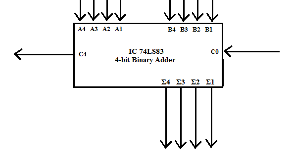
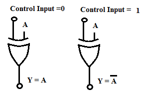
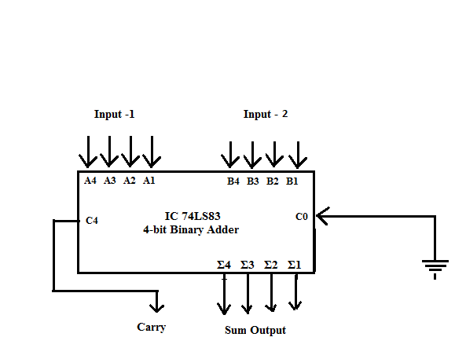
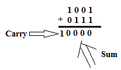
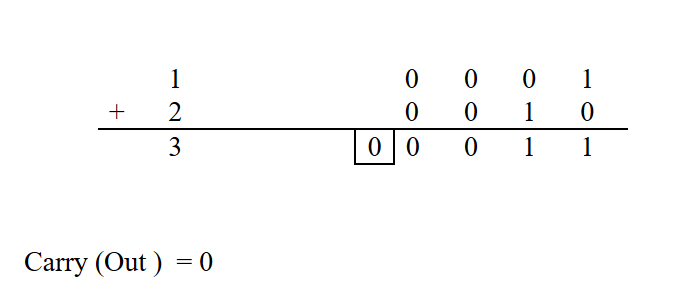
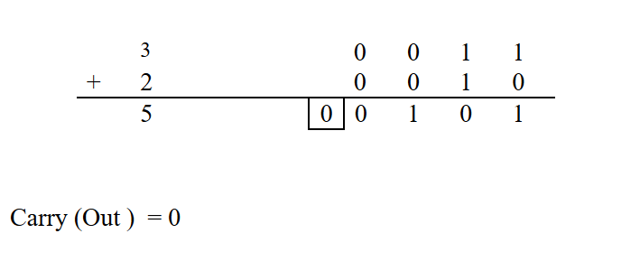
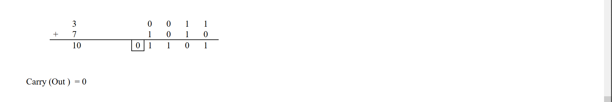
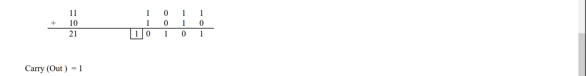

IC 74LS83 is a 4-bit parallel binary adder chip. It adds a four-bit number (nibble) with another 4-bit number. The block symbol for the IC is shown in Fig.1. This IC has two sets of 4-bit inputs along with a carry input C0. It performs binary addition on the A & B inputs and the carry input C0. It generates a 4-bit sum and a carry out C4.

 
 

 
Fig. 1 Block Symbol of four-bit adder IC

 

A circuit that can add or subtract 4-bit numbers can be designed using a control input and additional EX-OR IC 74LS86  For this we use the EX-OR gate as a “Controlled Inverter”. The exptlaination for this concept can be easily understood from Fig.2. The four bit input B4, B3, B2 & B1 can be passed through the controlled inverter IC74LS83 and the A4, A3, A2 & A1 are connected directly to A inputs of IC 74LS83 as shown in Fig 3.

 

Fig.2. Exclusive-OR gate used as a Controlled Inverter

 

 

Fig.3. 4-bit Binary Adder/Subtractor

 

 

Working:

Case 1: Four-bit Addition: When Control input is set = 0, the Carry –in input C0 = 0. In this situation, the EX-OR gate will simply pass on the Input -2 to B-inputs of Adder IC. It behaves to be transparent. IC 74LS83 will perform simple four-bit Binary addition. It produces the Carry and Sum output on C4 & the lines Σ4, Σ3, Σ2, & Σ1.

Example: Let Input-1 = A4 A3 A2 A1 = 1001 & Input-2 = B4 B3 B2 B1 = 0111 & control input be set to 0.

 

__Case 2: Four-bit Subtraction:__ When Control input is set = 1, the Carry –in input C0 = 1. In this situation, the Ex-OR gates will provide 1,’s complement of the Input-2 to the B-inputs of Adder IC. Moreover as C0 = 1, the addition of 1 to the 1’s complement of B gives 2’s complement of B.

Now the IC74LS83 adds Input-1 i.e. A4,A3, A2,A1 to the 2’s complemet of B and produces the Carry and Sum output on C4 & the lines Σ4, Σ3, Σ2, & Σ1.

 

**_Example1:_** Let Input-1 = A4 A3 A2 A1 = 1001 & Input-2 = 0111 & control input be set to 1.

1’s complement of 0111 = 1000. Since carry input C0 = 1, the input B becomes,

B4 B3 B2 B1 = 1000 + 1 = 1001.

Now IC 74LS83 performs addition of A & 2,s complement of B and produces the output.

Since a Carry is generated _discard the Carry_ and the Sum is the final output of subtraction operation.

The result is Σ4 Σ3 Σ2 & Σ1 = 0 0 1 0.

 

__*Example2:*__ Let Input-1 = A4 A3 A2 A1 = 0111 & Input-2 = 1001 & control input be set to 1.

1’s complement of Input-2 i.e. 1001 = 0110  Since carry input C0 = 1, the input B becomes,

B4 B3 B2 B1 = 0110 + 1 = 0111.

Now IC 74LS83 performs addition of A & 2’s complement of B and produces the output.

 

In this case _no Carry_ is generated during addition. Hence the answer can be obtained by taking the _2’s complement_ of the Sum output and _attaching a negative sign._

So the 2’s complement of 1110 = 0010 and the final result of subtraction is

Σ4 Σ3 Σ2 & Σ1 = - 0 0 1 0.

#### Numerical:

1+2

3+2

3+7

11+10

